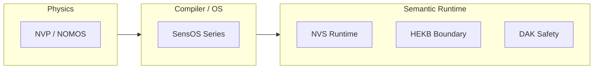

# Architecture

SensOS architecture documentation for developers and reviewers.

## Orientation

SensOS is an **Observation-Centered Runtime Platform**. Constitutional vision and procedural authority live in the RFC series; this section maps those norms onto system responsibility bands.

## Responsibility bands

| Band | Concern | Portal entry |
|---|---|---|
| Physics | Narrative vector / semantic field foundations | Research & Papers |
| Compiler / OS | Semantic compilation, NIR/ABI framing | Architecture (this section) |
| Semantic Runtime | Observation, projection, kernel, HEKB boundary | [Runtime](../runtime/index.md), [Kernel](../kernel/index.md), [HEKB](../hekb/index.md) |
| Applications | Product surfaces consuming the runtime | Out of scope for this portal |

## Normative stack (portal RFC numbering)

| RFC | Title | Role |
|---|---|---|
| [RFC-0000](../rfc/RFC-0000.md) | Ecosystem Constitution | Cross-series governance |
| [RFC-0001](../rfc/RFC-0001.md) | SensOS Conformance | Conformance levels |
| [RFC-0100](../rfc/RFC-0100.md) | Projection Verification | Verification protocol |
| [RFC-0199](../rfc/RFC-0199.md) | 01xx Band Closure | Reserved / band boundary |
| [RFC-0200](../rfc/RFC-0200.md) | Observation ABI | Observation contracts |
| [RFC-0201](../rfc/RFC-0201.md) | Projection ABI | Projection contracts |
| [RFC-0202](../rfc/RFC-0202.md) | Runtime Bridge | Non-determinism isolation |
| [RFC-0203](../rfc/RFC-0203.md) | HEKB Constraint Boundary | Knowledge-boundary narrowing |

## Design pillars

1. **Observation before meaning** — wire observations without forcing taxonomy at the edge.
2. **Projection as a distinct ABI** — deterministic projection engines consume annotated observations.
3. **Safety before capability** — expansion of autonomy must not outrank enforceable runtime safety.
4. **Evidence before inference** — interventions require observation-grounded evidence.
5. **Narrow HEKB product scope** — ConstraintStore / boundary oracle, not a broad world-model KB.

## Implementation mapping

| Concern | Spec (this portal) | Reference repository |
|---|---|---|
| Docs SSOT | sensos-docs | [GemminAI/sensos-docs](https://github.com/GemminAI/sensos-docs) |
| Runtime | Runtime + Kernel sections | [GemminAI/nvs-runtime](https://github.com/GemminAI/nvs-runtime) |

!!! info "No runtime sources here"
    Architecture pages describe contracts and topology. Executable sources remain in `nvs-runtime`.

## Related

- [RFC Map](../rfc/RFC_MAP.md)
- [Getting Started](../getting-started.md)
- [API](../api/index.md)
