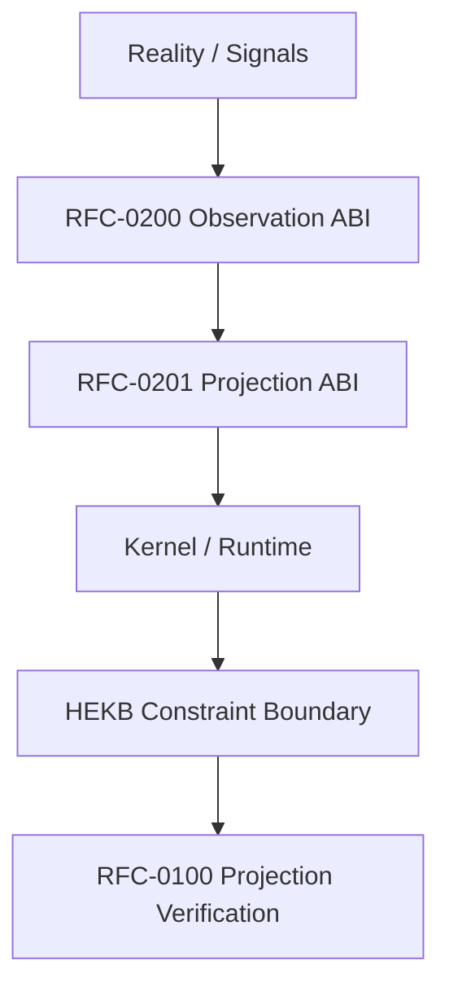

# Getting Started

Welcome to the SensOS Developer Portal.

This guide orients developers, researchers, reviewers, and contributors to the documentation structure and the repositories that surround it.

## Prerequisites

- Comfort reading normative specifications (RFC style, RFC 2119 keywords)
- Familiarity with git and GitHub pull requests
- Optional: Python 3.11+ if you build this portal locally

## 1. Read the constitutional layer

Start with governance before implementation details:

1. [RFC-0000 — Ecosystem Constitution](rfc/RFC-0000.md)
2. [RFC-0001 — SensOS Conformance](rfc/RFC-0001.md)
3. [RFC Map — Lifecycle](rfc/RFC_MAP.md)

## 2. Understand the observation stack

SensOS is an **Observation-Centered Intelligence Platform**. Meaning and safety are grounded in structured observation of runtime reality, not unconstrained generation.



| Layer | Document | Role |
|---|---|---|
| Observation | [RFC-0200](rfc/RFC-0200.md) | Data, not meaning — wire contracts for observations |
| Projection | [RFC-0201](rfc/RFC-0201.md) | Deterministic projection from annotated observation |
| Runtime Bridge | [RFC-0202](rfc/RFC-0202.md) | Isolation of non-deterministic annotation calls |
| HEKB Boundary | [RFC-0203](rfc/RFC-0203.md) | Constraint / boundary store (narrowed scope) |

## 3. Choose your path

=== "Developer"

    1. Skim [Architecture](architecture/index.md)
    2. Read [Runtime](runtime/index.md) and [API](api/index.md)
    3. Follow [Tutorials](tutorials/index.md)
    4. Map claims to RFCs via [RFC_MAP](rfc/RFC_MAP.md)

=== "Researcher"

    1. Open [Research](research/index.md) and [Papers](papers/index.md)
    2. Review [RFC-0100](rfc/RFC-0100.md) verification hypotheses
    3. Track status transitions in [RFC_MAP](rfc/RFC_MAP.md)

=== "Reviewer / Contributor"

    1. Confirm lifecycle stage before citing a document
    2. Prefer Canonical / Accepted RFCs for normative dependencies
    3. Propose changes via pull request to [sensos-docs](https://github.com/GemminAI/sensos-docs)

## 4. Repositories

| Repository | Purpose | URL |
|---|---|---|
| **sensos-docs** | Documentation SSOT (this portal) | [GitHub](https://github.com/GemminAI/sensos-docs) |
| **nvs-runtime** | NVS Runtime reference implementation | [GitHub](https://github.com/GemminAI/nvs-runtime) |

!!! warning "Separation of concerns"
    Runtime code lives in `nvs-runtime`. This portal documents contracts, architecture, and mapping — it does not ship executable runtime sources.

## 5. Build the portal locally

```bash
git clone https://github.com/GemminAI/sensos-docs.git
cd sensos-docs
python -m venv .venv
source .venv/bin/activate
pip install -r requirements.txt
mkdocs serve
```

## Next steps

- [Architecture overview](architecture/index.md)
- [RFC Index](rfc/index.md)
- [API Reference](api/index.md)
