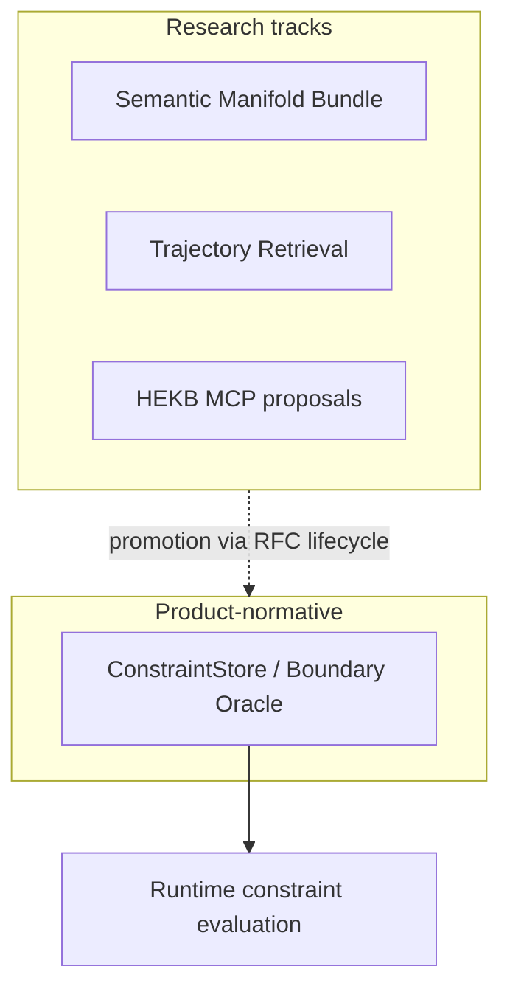

# HEKB

Hyper-dimensional Experience Knowledge Base — **portal documentation for the narrowed product boundary**.

## Product scope (current)

Under SensOS product governance, HEKB is treated as a **ConstraintStore / Boundary Oracle**:

- holds constraint and boundary definitions used by runtime evaluation
- does **not** claim ownership of customer application knowledge domains
- does **not** revive a broad general-intelligence world-model KB as product core

Normative portal entry: [RFC-0203 — HEKB Constraint Boundary](../rfc/RFC-0203.md).

!!! warning "Research vs product"
    Broader HEKB research (manifold bundles, retrieval fibers, MCP tool sketches) may appear under [Research](../research/index.md). Those tracks are **not** automatically product-normative unless promoted through the RFC lifecycle.

## Responsibility split

## Related RFCs

| RFC | Relationship |
|---|---|
| [RFC-0203](../rfc/RFC-0203.md) | Normative constraint-boundary definition |
| [RFC-0200](../rfc/RFC-0200.md) | Observation ABI upstream of knowledge concerns |
| [RFC-0100](../rfc/RFC-0100.md) | Projection/observation verification |
| [RFC-0000](../rfc/RFC-0000.md) | Series registration / governance |

## Implementation mapping

| Artifact | Location |
|---|---|
| Runtime reference | [nvs-runtime](https://github.com/GemminAI/nvs-runtime) |
| Docs SSOT | this portal |

## Related

- [Runtime](../runtime/index.md)
- [Kernel](../kernel/index.md)
- [Research](../research/index.md)
