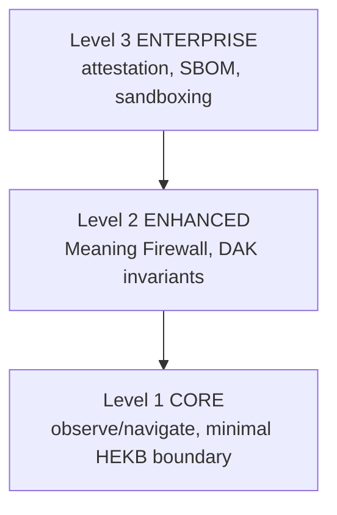

# RFC-0001: SensOS Conformance Guidelines

| Field | Value |
|---|---|
| **Status** | Draft |
| **Version** | 2.0.0 |
| **Last Updated** | 2026-07-26 |
| **Series** | Governance / Conformance (portal 00xx) |
| **Provenance** | Portal consolidation of SensOS Conformance Guidelines (`RFC-NVS-0001` lineage) |

## Abstract

Defines **conformance levels** and evaluation expectations for implementations claiming SensOS / NVS-Kernel compatibility. This RFC specifies *what must be demonstrated*, not concrete syscall binary layouts (those belong to runtime ABI RFCs).

RFC 2119 keywords (**MUST**, **SHOULD**, **MAY**, **MUST NOT**) apply.

## Specification

### 1. Scope

**In scope**

- Conformance levels and their cumulative inclusion
- Evaluation / evidence expectations
- Mapping to ABI and security companion RFCs

**Out of scope**

- Physical ABI layouts (see Runtime / Kernel ABI documents)
- Cryptographic protocol bodies (attestation / trust specs)
- Active defense algorithms (security specs)

### 2. Conformance levels

Levels are cumulative: `CORE ⊂ ENHANCED ⊂ ENTERPRISE`.

#### Level 1 — CORE

Intended for prototypes, education, and single-session local demos.

Implementations **MUST**:

- Provide basic observation and navigation primitives (`NVS.SysObserve`, `NVS.SysNavigate` or equivalent)
- Support attractor / geodesic path selection logic at the declared CORE surface
- Operate with an in-memory or explicitly documented single-session state model

#### Level 2 — ENHANCED

Intended for multi-tenant / governance-sensitive deployments.

Implementations **MUST**:

- Satisfy all CORE requirements
- Enforce Meaning Firewall–class boundary checks where claimed
- Preserve DAK / safety invariants required by companion security RFCs
- Support replanning or abort pathways on constraint violation

#### Level 3 — ENTERPRISE

Intended for high-assurance environments.

Implementations **MUST**:

- Satisfy all ENHANCED requirements
- Provide remote attestation / trust-manifest hooks as specified by trust RFCs
- Publish SBOM (or equivalent supply-chain inventory) for the conformance target
- Isolate untrusted execution contexts (sandboxing)

### 3. Evidence

A conformance claim **SHOULD** cite:

1. Target level
2. RFC versions pinned
3. Test / CTS identifiers (when available)
4. Lifecycle stage of each Depends-On RFC ([RFC_MAP](RFC_MAP.md))

### 4. Constitutional compliance

| Item | Statement |
|---|---|
| Applicable principles | Safety before capability; evidence before inference ([RFC-0000](RFC-0000.md) procedural + SensOS constitutional orientation) |
| Normative references | RFC-0000; Runtime ABI RFCs 0200–0203; Verification RFC-0100 |
| Responsibility boundary | Owns conformance *criteria*; does not own ABI field layouts or crypto primitives |

## Reference Implementation

| Artifact | Location | Notes |
|---|---|---|
| NVS Runtime | [nvs-runtime](https://github.com/GemminAI/nvs-runtime) | Partial mapping; CTS not yet Released |
| Docs portal | this repository | SSOT for criteria text |

## Related RFCs

- [RFC-0000](RFC-0000.md) — Ecosystem Constitution
- [RFC-0100](RFC-0100.md) — Projection Verification
- [RFC-0200](RFC-0200.md) — Observation ABI
- [RFC-0201](RFC-0201.md) — Projection ABI
- [RFC-0202](RFC-0202.md) — Runtime Bridge
- [RFC-0203](RFC-0203.md) — HEKB Constraint Boundary
