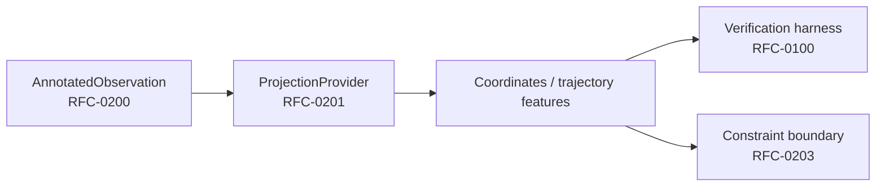

# RFC-0201: Projection ABI

| Field | Value |
|---|---|
| **Status** | Partial |
| **Version** | 1.0.0 |
| **Last Updated** | 2026-07-26 |
| **Series** | Runtime ABI (portal 02xx) |
| **Provenance** | Portal consolidation of Projection ABI lineage (`RFC-EXP5100` / Projection Provider track) |

## Abstract

Defines the **Projection ABI**: the contract by which an `AnnotatedObservation` is mapped into semantic coordinates / trajectory features by a ProjectionProvider.

Projection is **deterministic and non-ML at the ABI boundary** for the reference design path: providers may wrap models internally, but the public contract emphasizes reproducible projection outputs suitable for verification ([RFC-0100](RFC-0100.md)).

## Specification

### 1. Position in the stack

### 2. Provider contract (normative intent)

A ProjectionProvider **MUST**:

1. Accept `AnnotatedObservation` as its observation-side input
2. Emit a versioned projection result object (coordinates and declared feature fields)
3. Document determinism guarantees (bit-stable vs statistically stable)
4. Expose enough metadata for RFC-0100 residual / stability metrics

A ProjectionProvider **MUST NOT**:

1. Re-own Observation ingestion / annotation (AMS-0001)
2. Silently change result schemas without a version bump
3. Claim Meaning Firewall enforcement solely by existing (enforcement is a consumer concern)

### 3. Determinism classes

| Class | Meaning |
|---|---|
| Strict | Same input bytes → same output bytes |
| Statistical | Same input → outputs within declared metric bounds |
| Isolated-nondeterministic | Non-determinism confined behind [RFC-0202](RFC-0202.md); projection stage remains reproducible given annotation freeze |

### 4. Verification coupling

Any Released ProjectionProvider **SHOULD** publish RFC-0100 evidence for H0–H4 (or an explicitly waived subset).

### 5. Constitutional compliance

| Item | Statement |
|---|---|
| Applicable principles | Meaning structured before linguistic authority; evidence before inference |
| Normative references | RFC-0200; RFC-0100; RFC-0001 |
| Responsibility boundary | Owns projection contracts; does not own observation wire formats or constraint stores |

## Reference Implementation

| Artifact | Location | Mapping |
|---|---|---|
| NVS Runtime | [nvs-runtime](https://github.com/GemminAI/nvs-runtime) | Partial — projection / EXP-5100 lineage packages |
| Historical names | `RFC-EXP5100`, Projection Provider ABI drafts | Provenance aliases |

## Related RFCs

- [RFC-0200](RFC-0200.md) — Observation ABI
- [RFC-0202](RFC-0202.md) — Runtime Bridge
- [RFC-0203](RFC-0203.md) — HEKB Constraint Boundary
- [RFC-0100](RFC-0100.md) — Projection Verification
- [RFC-0199](RFC-0199.md) — 01xx Band Closure
