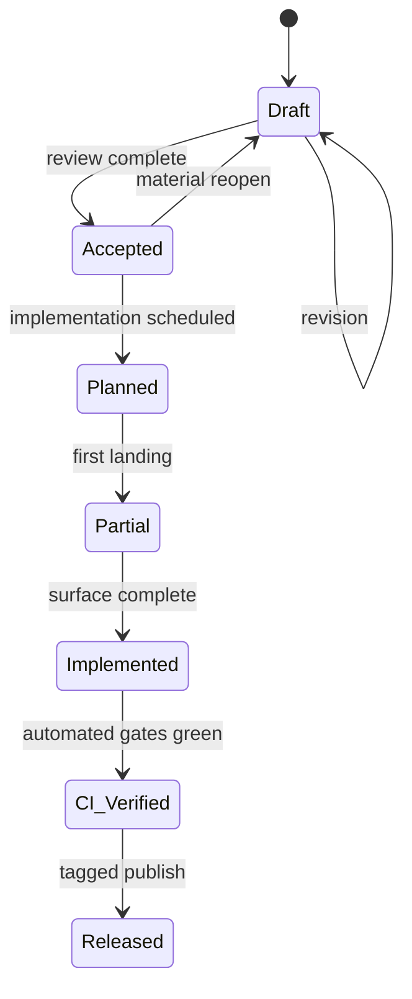

# RFC Map

Lifecycle and implementation-mapping index for SensOS portal RFCs.

## Lifecycle stages

| Stage | Meaning | Normative cite? | Implementation mapping |
|---|---|---|---|
| **Draft** | Public, mutable, under active editing | No | Informative only |
| **Accepted** | Working-group / editorial acceptance of intent | Provisional | Design may proceed |
| **Planned** | Scheduled for implementation; ABI not frozen | No | Tracked work item |
| **Partial** | Some sections or packages implemented | Mixed | Map per-section |
| **Implemented** | Reference implementation exists for normative surface | Yes (with version pin) | Linked repository + path |
| **CI Verified** | Automated checks pass against the RFC claims | Yes | CI workflow evidence required |
| **Released** | Published for external consumers; compatibility policy in force | Yes | Tagged release required |

## Series map

### Governance (00xx)

| RFC | Title | Lifecycle | Notes |
|---|---|---|---|
| [RFC-0000](RFC-0000.md) | Ecosystem Constitution | **Accepted** | Procedural root |
| [RFC-0001](RFC-0001.md) | SensOS Conformance | **Draft** | CORE / ENHANCED / ENTERPRISE |

### Verification band (01xx)

| RFC | Title | Lifecycle | Notes |
|---|---|---|---|
| [RFC-0100](RFC-0100.md) | Projection Verification | **Partial** | Hypotheses H0–H4; empirical track |
| [RFC-0199](RFC-0199.md) | 01xx Band Closure | **Planned** | Reserved end-of-band marker |

### Runtime ABI band (02xx)

| RFC | Title | Lifecycle | Notes |
|---|---|---|---|
| [RFC-0200](RFC-0200.md) | Observation ABI | **Partial** | AMS-0001 boundary |
| [RFC-0201](RFC-0201.md) | Projection ABI | **Partial** | Deterministic projector |
| [RFC-0202](RFC-0202.md) | Runtime Bridge | **Draft** | Non-determinism isolation |
| [RFC-0203](RFC-0203.md) | HEKB Constraint Boundary | **Accepted** | Narrowed product scope |

## Implementation mapping

| RFC | Reference repository | Mapping notes |
|---|---|---|
| RFC-0000 / RFC-0001 | — (governance) | Docs-only until CTS lands |
| RFC-0100 | [nvs-runtime](https://github.com/GemminAI/nvs-runtime) | Partial empirical evidence; not fully CI Verified |
| RFC-0200 | [nvs-runtime](https://github.com/GemminAI/nvs-runtime) | Observation layer contracts |
| RFC-0201 | [nvs-runtime](https://github.com/GemminAI/nvs-runtime) | Projection engine contracts |
| RFC-0202 | [nvs-runtime](https://github.com/GemminAI/nvs-runtime) | Bridge patterns vary by package |
| RFC-0203 | [nvs-runtime](https://github.com/GemminAI/nvs-runtime) | ConstraintStore role |

## Transition rules (summary)

1. **Draft → Accepted** requires explicit review record in the PR that updates this map.
2. **Accepted → Planned** requires an owner and target repository.
3. **Partial / Implemented** require a concrete path or package name in the Reference Implementation section of the RFC page.
4. **CI Verified** requires a named workflow and passing evidence link.
5. **Released** requires a git tag (or equivalent immutable release identifier).

## Related repositories

| Name | URL |
|---|---|
| SensOS Docs | https://github.com/GemminAI/sensos-docs |
| NVS Runtime | https://github.com/GemminAI/nvs-runtime |
