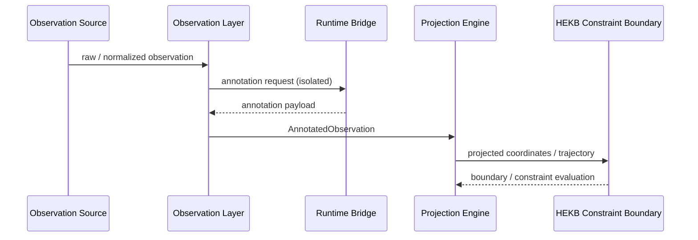

# Runtime

Documentation for the SensOS / NVS runtime surface as consumed by developers and reviewers.

## Purpose

The runtime executes observation-centered pipelines: ingest structured observations, project them into semantic coordinates, evaluate constraints, and expose governable trajectories.

## Scope of this section

| In scope | Out of scope |
|---|---|
| Runtime responsibility model | Full source trees |
| ABI / contract index | Deployment marketing |
| Mapping to RFCs | Vendor lock-in guides |

## Runtime pipeline

## Normative references

| Topic | RFC |
|---|---|
| Observation contracts | [RFC-0200](../rfc/RFC-0200.md) |
| Projection contracts | [RFC-0201](../rfc/RFC-0201.md) |
| Runtime Bridge | [RFC-0202](../rfc/RFC-0202.md) |
| Constraint boundary | [RFC-0203](../rfc/RFC-0203.md) |
| Verification protocol | [RFC-0100](../rfc/RFC-0100.md) |
| Conformance levels | [RFC-0001](../rfc/RFC-0001.md) |

## Reference implementation

| Repository | Role |
|---|---|
| [nvs-runtime](https://github.com/GemminAI/nvs-runtime) | NVS Runtime reference implementation |

!!! tip "Status discipline"
    Before depending on a runtime claim, confirm the corresponding RFC lifecycle stage in [RFC_MAP](../rfc/RFC_MAP.md).

## Related

- [Kernel](../kernel/index.md)
- [HEKB](../hekb/index.md)
- [API](../api/index.md)
